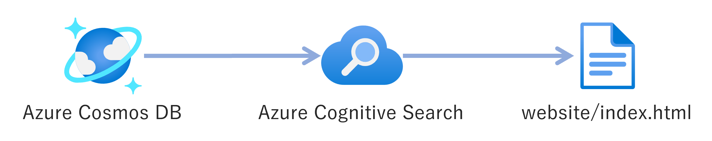
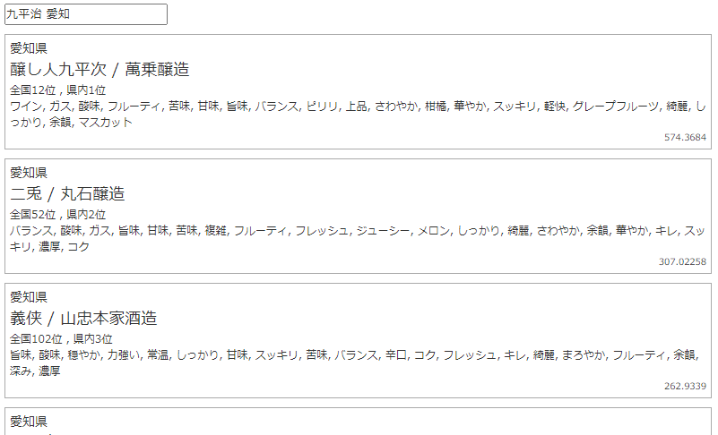

# Azure Cognitive Search のデモ環境構築
Azure Cosmos DB をデータソースとした Azure Cognitive Search のデモ環境を構築するためのコードを格納しているレポジトリです。

## 必要な環境
- [Azure CLI](https://docs.microsoft.com/ja-jp/cli/azure/install-azure-cli)
- [Azure Bicep](https://docs.microsoft.com/ja-jp/azure/azure-resource-manager/bicep/install)
- [.NET 6.0](https://dotnet.microsoft.com/ja-jp/download/dotnet/6.0)

## デプロイ方法

Azure CLI で Azure テナントへログインし、使用するサブスクリプションを選択します。
```bash
az login
az account set --subscription "xxxxxxxx-xxxx-xxxx-xxxx-xxxxxxxxxxxx"
```

> 参考：[Azure CLI を使用して Azure サブスクリプションを管理する方法](https://learn.microsoft.com/ja-jp/cli/azure/manage-azure-subscriptions-azure-cli)

Azure CLI で自身のユーザプリンシパルのIDを確認して、```parameters.json```の```parameters.myPrincipalId```に指定します。
```bash
az ad signed-in-user show --query "objectId" --output tsv
```

デモ環境を構築するために、```deploy.sh```スクリプトを実行します。
```bash
./deploy.sh [リソースグループ名]
# 例： ./deploy.sh rg-cogsearch-demo
```

```deploy.sh```は以下のことを実行します。
- Azure リソースのデプロイ (```deploy.bicep```)
  - Azure Cognitive Search
  - Azure Cosmos DB - Account
  - Azure Cosmos DB - Database
  - Azure Cosmos DB - Container
  - Azure Cosmos DB - Custom Role (マネージドIDによるデータアクセスのため)
  - Azure Cosmos DB - Custom Role Assignment (.NETアプリのため)
  - Azure Cosmos DB - Custom Role Assignment (Cognitive Search のため)
  - ロール割り当て (Cognitive Search → Cosmos DB: Cosmos DB アカウントの閲覧者ロール)
- Azure Cosmos DB へのサンプルアイテムの登録 (```datasource```フォルダ配下の.NETアプリを使用して```jsons/items.json```を登録する)
- Azure Cognitive Search のセットアップ
  - データソースの作成 (```deploy.sh内に記述```)
  - インデックスの作成 (```jsons/index.json```)
  - インデクサーの作成 (```jsons/indexer.json```)
- Webアプリ用の設定ファイルを生成 (```website/settings.js```)

## デプロイされる構成
```deploy.sh```により以下の構成がデプロイされます。


## デプロイした検索エンジンの使用
```website/index.html```を開いて、検索ボックスにワードを入力して日本酒を検索してみてください。

